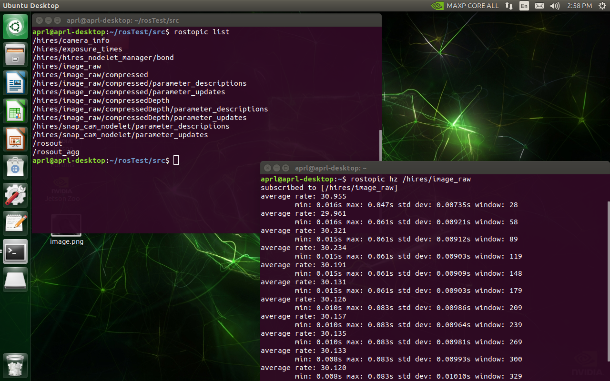
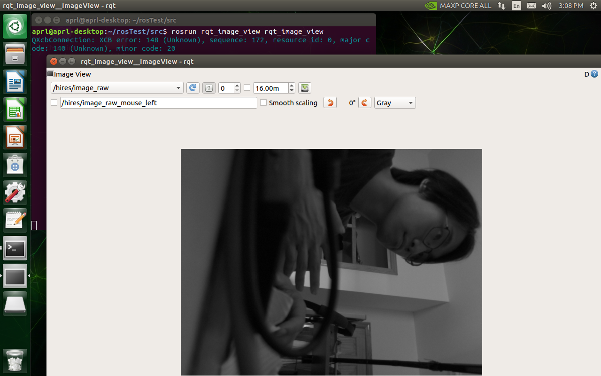
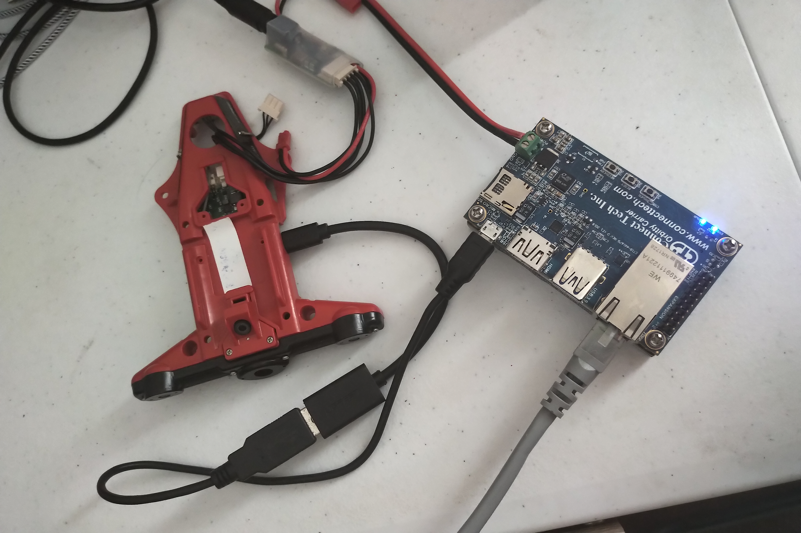

# Wired Communication Solution for ROS on SFP and TX2
The basic idea here is to utilize TX2's USB Ethernet device mode, connect SFP with USB cable and transfer ROS package directly. Can achieve low latency and wide bandwidth relative to Wifi.

## Hardware Requirements
- Snapdragon Flight Pro
- TX2 with Orbitty Carrier
- USB OTG cable + USB micro cable (or USB micro to micro OTG cable)

## USB Connection Setup
TX2's operating system has presetted USB device function, can work as serial device or USB Softether for PC to connect. Here we need to use an USB OTG cable from SFP (as USB host) to connect TX2 (as USB device). Use `lsusb` on SPF's shell to check if the USB connection is established:
```bash
~/ros/src/udp_com/scripts # lsusb
Bus 004 Device 001: ID 1d6b:0003 Linux Foundation 3.0 root hub
Bus 002 Device 001: ID 1d6b:0003 Linux Foundation 3.0 root hub
Bus 001 Device 001: ID 1d6b:0002 Linux Foundation 2.0 root hub
Bus 003 Device 004: ID 0955:7020 NVidia Corp.
Bus 003 Device 001: ID 1d6b:0002 Linux Foundation 2.0 root hub
```
We can see a device from NVidia has popped up. Use the following command to check if usb Ethernet devices is available:
```bash
~ # ifconfig -a
...

usb0      Link encap:Ethernet  HWaddr 46:6F:96:F7:6D:2E
          BROADCAST MULTICAST  MTU:1500  Metric:1
          RX packets:0 errors:0 dropped:0 overruns:0 frame:0
          TX packets:0 errors:0 dropped:0 overruns:0 carrier:0
          collisions:0 txqueuelen:1000
          RX bytes:0 (0.0 B)  TX bytes:0 (0.0 B)
...
```L4T 4.3 ip of TX2 is 192.168.55.1, so we need to manually set up SFP's ip in the same ip segment with TX2:
```bash
~ # ifconfig usb0 192.168.55.2 up
```
Then we can see `usb0` use `ifconfig`:
```bash
~ # ifconfig
...

usb0      Link encap:Ethernet  HWaddr 46:6F:96:F7:6D:2E
          inet addr:192.168.55.2  Bcast:192.168.55.255  Mask:255.255.255.0
          inet6 addr: fe80::446f:96ff:fef7:6d2e/64 Scope:Link
          UP BROADCAST RUNNING MULTICAST  MTU:1500  Metric:1
          RX packets:113 errors:0 dropped:0 overruns:0 frame:0
          TX packets:11 errors:0 dropped:0 overruns:0 carrier:0
          collisions:0 txqueuelen:1000
          RX bytes:13528 (13.2 KiB)  TX bytes:858 (858.0 B)
...
```
Now all the set up is done. We can launch a ROS core on TX2 or SFP and view it from the other one.

## Example on Transferring Camera Data
After the configeration above, first we launch a Camere demo node on SFP. Steps can be find at https://github.com/ATLFlight/snap_cam_ros 
Then Connect to TX2 via VNC, launch a terminal and input:
```bash
export ROS_MASTER_URI=http://192.168.55.2:11311
```
to let ROS konw where the ROS master is. The ip address is the same with what we have set up in SFP.
Then use `rostopic` we can see the nodes on SFP's ROS:

We can see that the image data is received without frame lost.
Use `rqt` tool to view the image stream, delay is very small!

The USB physical connection show as below:
